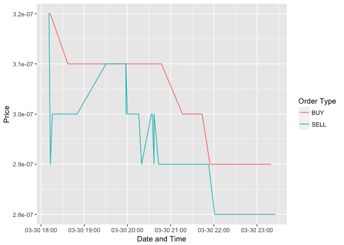

<!-- README.md is generated from README.Rmd. Please edit that file -->
ccex: An R client for the [C-Cex Crypto-currency Exchange](https://c-cex.com)
=============================================================================

**Authors:** Michael J. Kane<br/>
**License:** [LGPL](https://opensource.org/licenses/LGPL-2.1)

[](https://travis-ci.org/kaneplusplus/ccex)
[](https://ci.appveyor.com/project/kaneplusplus/ccex)
[](https://codecov.io/github/kaneplusplus/ccex?branch=master)

Disclaimer
==========

This software is in no way affiliated, endorsed, or approved by the
[C-Cex crypto-currency exchange](https://c-cex.com/) or any of its affiliates. 
It comes with absolutely no warranty and should not be used in actual trading 
unless the user can read and understand the source and know what you are doing.

Overview
========

Package 'ccex' is an R implementation of the REST interface used by the
[C-Cex crypto-currency exchange](https://c-cex.com/). It provides
functions for endpoints supported by the exchange. This includes the
ability to retrieve price, volume, and order book information as well as
the ability to trade crypto-currencies.

Calls to the exchange are categorized as either public, which includes
requests for price, volume, and order book information, and private,
which includes all requests requiring an account including placing buy
or sell orders. Public calls can be used directly by installing the
package. Private calls require that you [create an
account](https://c-cex.com/?id=reg) and create an API and secret key
with appropriate permissions.

Private calls retrieve the API and secret key using the CCEX\_API\_KEY
and CCEX\_SECRET\_KEY environment variables. These may be set by the
user before opening the R session or, they can be set using the
'ccex\_authenticate' function.

Quickstart
==========

Install
-------

The package is available from GitHub and will be uploaded to CRAN
shortly. If you wish to install the development version then install the
[devtools package](https://CRAN.R-project.org/package=devtools),
available from CRAN. A

``` r
#install.packages("devtools")
devtools::install_github("kaneplusplus/ccex")
```

Using the Package
-----------------

After installation, you may query the exchange with any of the public
calls. For example, if we want to see the spread of the cost of doge
coins in bitcoins, we can use the following code.

``` r
library(ccex)
library(scales)
library(ggplot2)

# The price of doge coins in bitcoins.
doge_btc = getmarkethistory(market='doge-btc', count=100)$result

# ggplot2 handle POSIXct types only.
doge_btc$time_stamp = as.POSIXct(doge_btc$time_stamp)

ggplot(doge_btc, aes(x=time_stamp, y=price, group=order_type, 
  color=order_type)) + geom_line() + 
  scale_x_datetime(breaks=date_breaks("hours"), 
    labels=date_format("%m-%d %H:%M")) + xlab("Date and Time") +
  ylab("Price") + scale_colour_discrete(name="Order Type")
```


