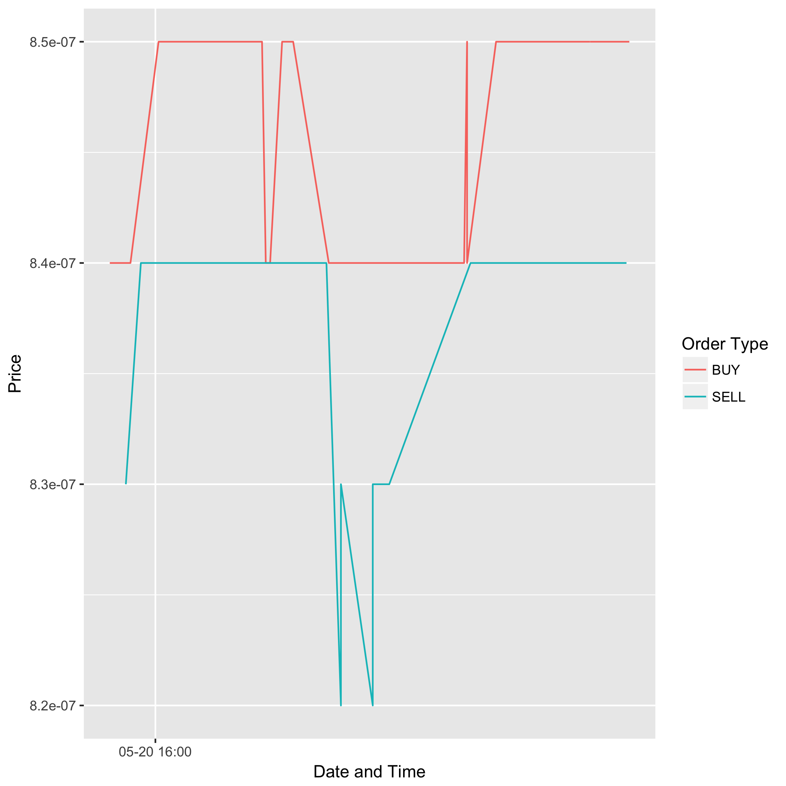

  ---
output:
  github_document:
    hard_line_breaks: false
---
<!-- README.md is generated from README.Rmd. Please edit that file -->

bittrex: An R client for the [Bittrex Crypto-Currency Exchange](https://bittrex.com)
=====================================================

**Authors:** Michael J. Kane<br/>
**License:** [LGPL-2](https://opensource.org/licenses/LGPL-2.1)

[](https://travis-ci.org/kaneplusplus/bittrex)
[](https://ci.appveyor.com/project/kaneplusplus/bittrex)
[](https://codecov.io/github/kaneplusplus/bittrex?branch=master)
[](https://github.com/ropensci/onboarding/issues/120)


Disclaimer
===

This software is in no way affiliated, endorsed, or approved by the
[Bittrex crypto-currency exchange](https://bittrex.com/) or any of its affiliates. 
It comes with absolutely no warranty and should not be used in actual trading 
unless the user can read and understand the source and know what you are doing.

Overview
===

Package 'bittrex' is an R implementation of the REST interface used by the [Bittrex
crypto-currency exchange](https://bittrex.com/). It provides functions 
for endpoints supported by the exchange. This includes the ability 
to retrieve price, volume, and order book information as well as the ability
to trade crypto-currencies.

Calls to the exchange are categorized as either public, which includes 
requests for price, volume, and order book information, and private, which 
includes all requests requiring an account including placing buy or sell 
orders. Public calls can be used directly by installing the package. 
Private calls require that you 
[create an account](https://https://bittrex.com/account/Register) and create an API and secret 
key with appropriate permissions.

Private calls retrieve the API and secret key using the BITTREX_API_KEY and 
BITTREX_SECRET_KEY environment variables. These may be set by the user before 
opening the R session or, they can be set using the 'bittrex_authenticate' 
function.

Quickstart
===

Install
---

The package is available from GitHub and will be uploaded to CRAN
shortly. If you wish to install the development version then install the 
[devtools package](https://CRAN.R-project.org/package=devtools), available 
from CRAN. 

```{r}
#install.packages("devtools")
devtools::install_github("kaneplusplus/bittrex")
```

Using the Package
---

After installation, you may query the exchange with any of the public
calls. For example, if we want to see the spread of the cost of doge 
coins in bitcoins, we can use the following code.

```{r}
library(bittrex)
library(scales)
library(ggplot2)

# The price of doge coins in bitcoins.
doge_btc = bt_getmarkethistory(market='btc-doge')$result

ggplot(doge_btc, aes(x=time_stamp, y=price, group=order_type, 
  color=order_type)) + geom_line() + 
  scale_x_datetime(breaks=date_breaks("hours"), 
    labels=date_format("%m-%d %H:%M")) + xlab("Date and Time") +
  ylab("Price") + scale_colour_discrete(name="Order Type")
```



Contributing
---

If you would like to contribute to the project please contact
the maintainer directly. Please note that this project is
released with a [Contributor Code of Conduct](CONDUCT.md).
By participating in this project you agree to abide by its terms.

[](https://ropensci.org)
